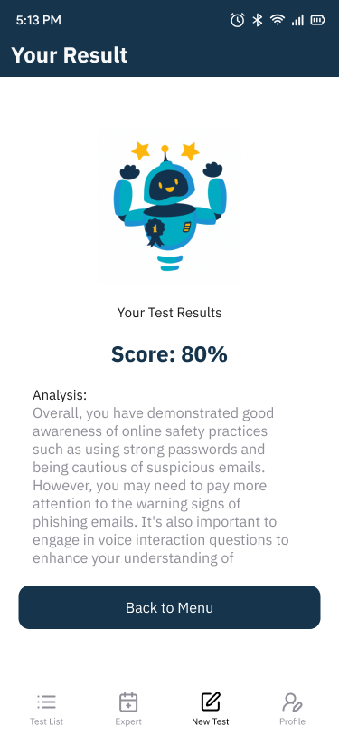

<br><br>

<!-- project philosophy -->


>  Aegis AI empowers users to take control of their online safety with personalized, interactive tests that adapt to their responses. Featuring voice interactions, it identifies vulnerabilities and teaches effective security practices, helping users protect themselves from cyber risks.

## User Stories
### User
- **As a user, I want to take a simple quiz about online safety, so I can understand how to protect myself from cyber threats.**
- **As a user, I want to get helpful tips after the quiz, so I can learn better ways to stay safe when using the internet.**
- **As a user, I want to request a custom test from an expert, so that it matches my specific needs and challenges.** 

### Expert
- **As an expert, I want to manage all user requests and review their previous tests and results, so I can provide better insights and support.**

- **As an expert, I want to view additional user request details, such as social links, to better understand their context and needs.**

- **As an expert, I want to create custom test questions for each user based on their past test results and new information, so the tests are tailored to their improvement areas.**

### Admin
- **As an admin, I want to have the same capabilities as an expert, so I can manage user requests and tests effectively.**

- **As an admin, I want to manage users, review their profiles, and delete their accounts if necessary, to maintain a secure and organized platform.**

- **As an admin, I want to review user requests to become experts by checking their certifications or other required files, to ensure only qualified individuals are approved.**

<br><br>
<!-- Tech stack -->


###  AegisAI is built using the following technologies:

### Flutter
The app is built with the [Flutter app development framework](https://flutter.dev/), enabling cross-platform development. This allows us to use a single codebase for mobile, desktop, and web applications.

### Laravel
The backend is powered by the [Laravel framework](https://laravel.com/), which provides a robust and secure API for handling user requests, managing authentication, and interacting with the database.

### Vue.js
For the web front-end, we use [Vue.js](https://vuejs.org/), a progressive JavaScript framework that builds responsive and dynamic user interfaces, providing seamless interactions on the web.

### MySQL
The project uses [MySQL](https://www.mysql.com/) as the relational database management system to store user data, quiz results, and security awareness progress securely.


<br><br>
<!-- UI UX -->


> We began designing AegisAI by mapping the user flow, followed by creating wireframes and mockups. We iterated on the design until we achieved an ideal layout that ensures easy navigation and a seamless user experience.

- Project Figma design [Figma](https://www.figma.com/design/OSIpVHQafWlkto6pnhEM7t/Final-Project?node-id=0-1&t=LCd9DlfpPxIjU8cO-1)


### Mockups
  | Listen Question | Answer Question | Result
| ---| ---| ---| 
 |  |  |  |

<br><br>

<!-- Database Design -->


###  Leveraging [MySQL Workbench](https://www.mysql.com/products/workbench/), I crafted and implemented a robust, expertly designed database architecture to power seamless functionality.
| Database Diagram |
| --- |
|  |


<br><br>


<!-- Implementation -->


### User Screens (Mobile)

| Dynamic Test (GIF) | Voice Interaction (GIF) | AI Result (GIF) |
| --- | --- | --- |
|  |  |   |

| Test List  | Expert Test List | Intro Screen (GIF) |
| --- | --- | --- |
|  |  |  |


### Admin Screens (Web)

| User Requests | Application Overview |
| --- | --- |
|  |  |

| Test Details | Test List |
| --- | --- |
|  |  |

| User List (Dark Mode) | User List |
| --- | --- |
|  |  |

| Add Test (GIF) |  
| --- | 
|  | 

<br><br>


<!-- Prompt Engineering -->


###  Mastering AI Interaction: Unveiling the Power of Prompt Engineering:

- This project uses advanced prompt engineering techniques to optimize the interaction with natural language processing models. By skillfully crafting input instructions, we tailor the behavior of the models to achieve precise and efficient language understanding and generation for various tasks and preferences.


<br><br>

<!-- AWS Deployment -->


###  AI Safety Solutions: Making Online Security Better with Scalable Deployment:

- This project uses AWS to deploy the AI-powered backend, providing scalability, reliability, and strong performance. It runs on an EC2 instance, and Amazon S3 is used for secure and efficient storage of uploaded images and AI models used in the application.
- API Documentation: You can access detailed API documentation for this project through the following link [Postman](https://documenter.getpostman.com/view/15123466/2sAYQcFW1X)


### Postman Screens

| Login | Start Test (AI) |
| --- | --- |
|  |  |

| Answer Question (AI) | Result (AI)|
| --- | --- |
|  |  |


<br><br>

<!-- Unit Testing -->
<!-- 

###  Dynamic Security Design: Leveraging Prompt Engineering for Smarter Assessments:

- This project employs advanced prompt engineering to design a structured, dynamic system for cybersecurity assessments. By leveraging a JSON-based framework, it ensures seamless integration and adaptability, tailoring questions to user behaviors and responses. The design emphasizes diverse question formats, interactive voice features, and adaptive sequencing to maintain engagement and relevance. With a focus on simplicity and effectiveness, the project provides actionable insights and inspiration for addressing online safety challenges, fostering improved habits and understanding of cybersecurity risks.

<br><br> -->


<!-- How to run -->


# AegisAI Installation Guide

> Follow these steps to set up **AegisAI** locally, from prerequisites to configuration and running the project.

---

## Prerequisites

Ensure the following are installed on your system before proceeding:

1. **Node.js** (for Vue.js frontend)
   ```sh
   npm install npm@latest -g
   ```

2. **Flutter SDK** (for the mobile application)
   - [Installation Guide](https://flutter.dev/docs/get-started/install)

3. **Laravel Framework** (for the backend)
   - [Installation Guide](https://laravel.com/docs/10.x/installation)

4. **Composer** (for PHP dependencies)
   - [Installation Guide](https://getcomposer.org/download/)

5. **Database** (e.g., MySQL)
   - Install MySQL or ensure it’s running locally.

---

## Installation

### 1. Clone the Repository
Clone the entire project, which includes the backend, frontend, and mobile app.
- frontend folder
   ```sh
   git clone https://github.com/yousifdahabra/aegis-ai-web.git
   ```
- backend folder
   ```sh
   git clone https://github.com/yousifdahabra/aegis-ai-server.git
   ```
- mobile folder
   ```sh
   git clone https://github.com/yousifdahabra/aegis-ai-app.git
   ```

---

### 2. Backend Setup (Laravel)
Navigate to the `backend` folder:
```sh
cd backend
```

#### Install Dependencies
```sh
composer install
```

#### Environment Configuration
1. Copy the `.env.example` file to `.env`:
   ```sh
   cp .env.example .env
   ```
2. Update the `.env` file with your database credentials:
   ```env
   DB_CONNECTION=mysql
   DB_HOST=127.0.0.1
   DB_PORT=3306
   DB_DATABASE=aegisai
   DB_USERNAME=root
   DB_PASSWORD=your_password
   ```

#### Generate Keys and Migrate Database
```sh
php artisan key:generate
php artisan migrate --seed
```

#### Run the Server
Start the Laravel backend:
```sh
php artisan serve
```
The backend API will be available at `http://127.0.0.1:8000`.

Repository: [Laravel Backend](https://github.com/yousifdahabra/aegis-ai-server)

---

### 3. Frontend Setup (Vue.js)
Navigate to the `frontend` folder:
```sh
cd frontend
```

#### Install Dependencies
```sh
npm install
```

#### Environment Configuration
1. Create a `.env` file in the `frontend` folder:
   ```sh
   touch .env
   ```
2. Add the backend API URL to the `.env`:
   ```env
   VUE_APP_API_URL=http://127.0.0.1:8000/api
   ```

#### Run the Frontend
Start the Vue.js development server:
```sh
npm run serve
```
The frontend will be available at `http://localhost:8080`.

Repository: [Vue.js Frontend](https://github.com/yousifdahabra/aegis-ai-web)

---

### 4. Mobile App Setup (Flutter)
Navigate to the `mobile` folder:
```sh
cd mobile
```

#### Install Dependencies
```sh
flutter pub get
```

#### Environment Configuration
1. Update the API base URL in the `lib/utils/config.dart` file:
   ```dart
   const String API_BASE_URL = 'http://127.0.0.1:8000/api';
   ```

#### Run the App
Start the Flutter development environment:
```sh
flutter run
```

Repository: [Flutter Mobile App](https://github.com/yousifdahabra/aegis-ai-app)

---
Now you’re all set to explore **AegisAI** locally! 🚀 Let me know if you face any issues during setup.

