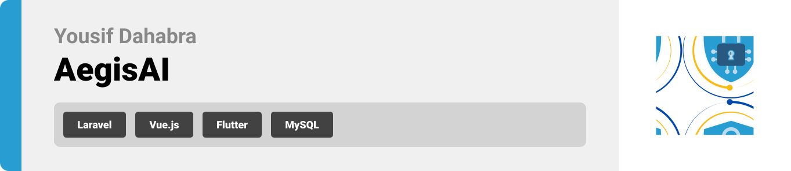
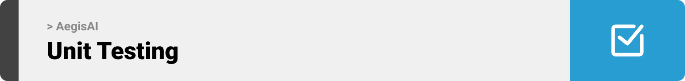

<br><br>

<!-- project philosophy -->


> AegisAI that uses social engineering to test and enhance employers' security awareness.
>
>  It simulates real-world cyber threats, analyzes responses, and identifies vulnerabilities, aiming to reduce risks and foster stronger cybersecurity practices in organizations.

## User Stories
### User
- **As a user, I want to take a simple quiz about online safety, so I can understand how to protect myself from cyber threats**
- **As a user, I want to get helpful tips after the quiz, so I can learn better ways to stay safe when using the internet.**
- **As a user, I want to request a custom test from an expert, so that it matches my specific needs and challenges.**

### Expert
- **As an expert, I want to manage all user requests and review their previous tests and results, so I can provide better insights and support.**

- **As an expert, I want to view additional user request details, such as social links, to better understand their context and needs.**

- **As an expert, I want to create custom test questions for each user based on their past test results and new information, so the tests are tailored to their improvement areas.**

### Admin
- **As an admin, I want to have the same capabilities as an expert, so I can manage user requests and tests effectively.**

- **As an admin, I want to manage users, review their profiles, and delete their accounts if necessary, to maintain a secure and organized platform.**

- **As an admin, I want to review user requests to become experts by checking their certifications or other required files, to ensure only qualified individuals are approved.**

<br><br>
<!-- Tech stack -->


###  AegisAI is built using the following technologies:

### Flutter
The app is built with the [Flutter app development framework](https://flutter.dev/), enabling cross-platform development. This allows us to use a single codebase for mobile, desktop, and web applications.

### Laravel
The backend is powered by the [Laravel framework](https://laravel.com/), which provides a robust and secure API for handling user requests, managing authentication, and interacting with the database.

### Vue.js
For the web front-end, we use [Vue.js](https://vuejs.org/), a progressive JavaScript framework that builds responsive and dynamic user interfaces, providing seamless interactions on the web.

### MySQL
The project uses [MySQL](https://www.mysql.com/) as the relational database management system to store user data, quiz results, and security awareness progress securely.


<br><br>
<!-- UI UX -->


> We designed AegisAI using wireframes and mockups, iterating on the design until we reached the ideal layout for easy navigation and a seamless user experience.

- Project Figma design [Figma](https://www.figma.com/design/OSIpVHQafWlkto6pnhEM7t/Final-Project?node-id=0-1&t=LCd9DlfpPxIjU8cO-1)


### Mockups
| Home screen  | Menu Screen | Order Screen |
| ---| ---| ---|
|  |  |  |

<br><br>

<!-- Database Design -->


###  Architecting Data Excellence: Innovative Database Design Strategies:

- Insert ER Diagram here


<br><br>


<!-- Implementation -->


### User Screens (Mobile)
| Login screen  | Register screen | Landing screen | Loading screen |
| ---| ---| ---| ---|
|  |  |  |  |
| Home screen  | Menu Screen | Order Screen | Checkout Screen |
|  |  |  |  |

### Admin Screens (Web)
| Login screen  | Register screen |  Landing screen |
| ---| ---| ---|
|  |  |  |
| Home screen  | Menu Screen | Order Screen |
|  |  |  |

<br><br>


<!-- Prompt Engineering -->


###  Mastering AI Interaction: Unveiling the Power of Prompt Engineering:

- This project uses advanced prompt engineering techniques to optimize the interaction with natural language processing models. By skillfully crafting input instructions, we tailor the behavior of the models to achieve precise and efficient language understanding and generation for various tasks and preferences.

<br><br>

<!-- AWS Deployment -->


###  Efficient AI Deployment: Unleashing the Potential with AWS Integration:

- This project leverages AWS deployment strategies to seamlessly integrate and deploy natural language processing models. With a focus on scalability, reliability, and performance, we ensure that AI applications powered by these models deliver robust and responsive solutions for diverse use cases.

<br><br>

<!-- Unit Testing -->


###  Precision in Development: Harnessing the Power of Unit Testing:

- This project employs rigorous unit testing methodologies to ensure the reliability and accuracy of code components. By systematically evaluating individual units of the software, we guarantee a robust foundation, identifying and addressing potential issues early in the development process.

<br><br>


<!-- How to run -->


> To set up AegisAI locally, follow these steps:

### Prerequisites

This is an example of how to list things you need to use the software and how to install them.
* npm
  ```sh
  npm install npm@latest -g
  ```

### Installation

_Below is an example of how you can instruct your audience on installing and setting up your app. This template doesn't rely on any external dependencies or services._

1. Get a free API Key at [example](https://example.com)
2. Clone the repo
   git clone [github](https://github.com/your_username_/Project-Name.git)
3. Install NPM packages
   ```sh
   npm install
   ```
4. Enter your API in `config.js`
   ```js
   const API_KEY = 'ENTER YOUR API';
   ```

Now, you should be able to run AegisAI locally and explore its features.